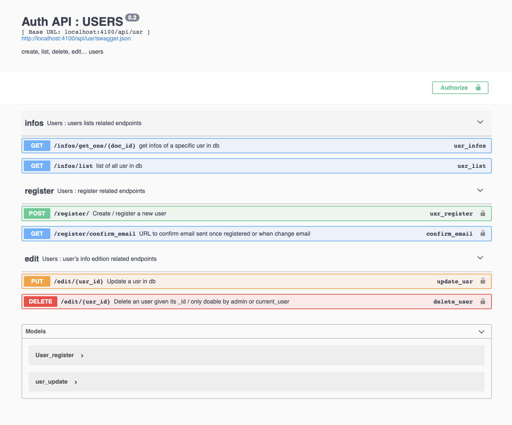
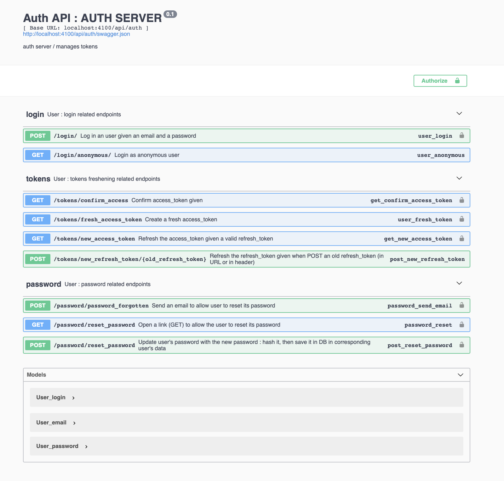

<div align=center> 
	<h1>OPEN AUTH MICROSERVICE </h1>
	<h4>aka TokTok</h4>
</div>

---------

<h2 align=center>
	
</h2>

-------
## PRESENTATION

#### An REST API for an open source user manager and authentication microservice

- this auth server was extracted / insulated / adapted from solidata_backend
- compatible with TADATA! sofware suite ([ApiViz](https://github.com/entrepreneur-interet-general/CIS-front) / [Solidata_frontend](https://github.com/entrepreneur-interet-general/solidata_frontend) / [OpenScraper](https://github.com/entrepreneur-interet-general/OpenScraper) )


--------

## DEVELOPPERS

- Please check out our **[guidelines](./GUIDELINES_DEV.md)** first
- Check also the **[`prod_snippets`](./prod_snippets)** if you encounter problems while installing locally or setting your server : [install mongodb](./prod_snippets/prod_mongodb.md), [set up supervisor](./prod_snippets/prod_supervisor.md), [set up git](./prod_snippets/prod_git.md), [set up nginx](./prod_snippets/prod_nginx.md), [set up ubuntu](./prod_snippets/prod_ubuntu.md)...

-------

## GOALS

- a simple server to manage users and authorizations based on JWT exchanges between client and server
- possibility to switch on/off some extra features as : RSA decryption/encryption, anonymous JWT 


------

## TECHNICAL POINTS

#### Tech stack
- _Language_  : **[Python 3.6](https://www.python.org/)**... praise be...
- _Framework_ : **[Flask](http://flask.pocoo.org/)**... minimalistic Python framework
- _API_       : **[Flask-RestPlus](http://flask-restplus.readthedocs.io/en/stable/)**... Swagger documentation integrated, praise be noirbizarre...
- _Security_  : **[Flask-JWT-extended](https://flask-jwt-extended.readthedocs.io/en/latest/)**... wrapper JWT for Flask
- _Emailing_  : **[Flask-email](https://pythonhosted.org/Flask-Mail/)**... templating, sending, etc...
- and more...

#### Features :

- JWT (JSON Web Tokens) :
	- access and refresh token for security over all the app
- user :
	- anonymous login (automatic)
	- login / register user 
	- confirm user by sending a confirmation link (protected) in an email 
	- password forgotten by sending a link (protected) in an email with redirection to new password form 
	- reset password from client interface (protected) ...
- Documentation 
	- on all API endpoints with Swagger (and some patience from the developer)

##### Features TO DO  :
- user : 
	- edit user
	- edit email


-------

## INSTALLATION WALKTHROUGH 

### _LOCALLY_

- clone / fork the depo 
	...

- create a virtual environment for Python3
	
	```bash
	python3 -m venv venv
	source venv/bin/activate
	pip install --upgrade pip
	pip install -r requirements.txt
	```

- create a secret config_file `config_prod.py` in the folder `./auth_api` based 

	```bash
	cp ./auth_api/config_prod_example.py ./auth_api/config_prod.py
	nano ./auth_api/config_prod.py 
	```

- pay attention at the MONGO_URI variable depending on your local mongodb configuration...
	- The following is the standard URI connection scheme (from [mongo documentation](https://docs.mongodb.com/manual/reference/connection-string/)):
		```bash
		mongodb://[username:password@]host1[:port1][,host2[:port2],...[,hostN[:portN]]][/[database][?options]]
		```

- run the app in `default` mode (without possibility to send email) : 

	```bash
	python appserver.py
	``` 

- test the following urls 
	
	```
	http://localhost:4100/api/auth/documentation
	http://localhost:4100/api/usr/documentation
	```

- < if no longer needed deactivate your virtual environment >

	```bash
	deactivate
	```

### _CLI OPTIONS_

There are some options you can play with while running the service :
- `--mode` : `default` (default), `dev_email`, `preprod`, `production`
- `--host` : the IP of your server (default : `localhost`)
- `--port` : the port you want to run the app on (default : `4100`)
- `--salt` : if you receive the login|register forms encrypted (default : `yes`))
- `--anojwt` : if you need to check the presence/validity of an "anonymous_jwt" in the request (default : `yes`) 

In practice : 

- you can run the app in dev mode (with possibility to send email) : 

	```bash
	python appserver.py --mode=dev_email
	``` 

- you can choose to deactivate the integrated RSA decryption in the `login` and `register` endpoints

	```bash
	python appserver.py --salt=no
	``` 

- you can choose to deactivate the check for a anonymous JWT in the `login` and `register` endpoints

	```bash
	python appserver.py --anojwt=no
	``` 

- you can add up those options in the command line
	```bash
	python appserver.py --anojwt=no --salt=yes --mode=dev_email
	``` 

### _PRODUCTION_

- for now we are using the following configuration

	- droplet in digitalocean.com
	- ubuntu 18.04
	- 3Go RAM / 2CPU
	- 60Go memory

- configure your server (user, firewall...): 
	- cf : [ docs 1 ](https://www.digitalocean.com/community/tutorials/initial-server-setup-with-ubuntu-18-04) 
	- cf : [ docs 2 ](https://www.digitalocean.com/community/tutorials/how-to-setup-a-firewall-with-ufw-on-an-ubuntu-and-debian-cloud-server) 
	- cf : [ docs 3 ](https://scottlinux.com/2011/10/10/ufw-allow-from-specific-ip-on-specific-port/ )

- install mongodb : 
	- cf : [ docs 1 ](https://docs.mongodb.com/manual/tutorial/install-mongodb-on-ubuntu/)
	- cf : [ docs 2 ](https://www.digitalocean.com/community/tutorials/how-to-install-mongodb-on-ubuntu-18-04)	
	- cf : [ docs 3 ](https://www.digitalocean.com/community/tutorials/how-to-install-and-secure-mongodb-on-ubuntu-16-04#part-two-securing-mongodb) 
	- cf : [ docs 4 ](https://www.tecmint.com/install-mongodb-on-ubuntu-18-04/ )


- install nginx : 
	- cf : [ docs 1 ](https://www.digitalocean.com/community/tutorials/how-to-install-nginx-on-ubuntu-18-04)
	- cf :[ docs 2](https://linuxize.com/post/how-to-install-nginx-on-ubuntu-18-04/)
	- cf : [ docs 3 ](https://linuxize.com/post/how-to-set-up-nginx-server-blocks-on-ubuntu-18-04/ )


- install git on your server
	- cf : [ docs 1 ](https://www.digitalocean.com/community/tutorials/how-to-install-git-on-ubuntu-18-04)	- basically : 
		```bash
		sudo apt-get update
		sudo apt-get install git
		git --version
		```
	- go to your directory and init git :
		```
		git init . 
		git remote add origin https://github.com/entrepreneur-interet-general/solidata_backend.git
		git pull origin master
		```

- same steps than for local installation (virtual env, install dependencies, config_prod.py file, ) ... 

- run the app in production mode (with possibility to send email) : 

	```bash 
	python appserver.py --mode=production
	``` 

------

## INSPIRATIONS / BENCHMARK

- [Dataiku](https://www.dataiku.com/), [Parabola](https://parabola.io/), but they are proprietary solutions (and too complex for our pruposes)... Not to mention they are very expensive...
- [Match ID](https://matchid-project.github.io/), but the backend doesn't resolve the "sharing" part with levels as ["opendata", "commons", "collective", "private"], and no BDD to back up recipes


-------

## CREDITS 

#### Solidata's team thanks :

- the [SocialConnect](https://entrepreneur-interet-general.etalab.gouv.fr/defi/2017/09/26/socialconnect/) project, aka "Carrefour des Innovations Sociales"
- the [EIG](https://entrepreneur-interet-general.etalab.gouv.fr/) program by [Etalab](https://www.etalab.gouv.fr/)
- the [CGET](http://www.cget.gouv.fr/)

#### Contacts - maintainance :

- [Julien Paris](<mailto:julien.paris@cget.gouv.fr>), developer (aka [JPy](https://twitter.com/jparis_py) on Twitter)

-------

## SCREENSHOTS

-------


-------



